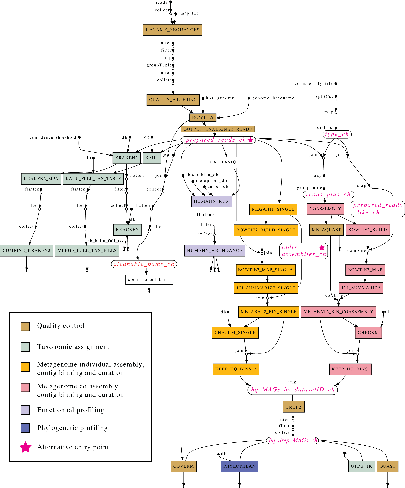

# Metagenomics-nf
[](https://opensource.org/licenses/MIT)

## ABOUT
This Nextflow workflow automates many different metagenomics analyses steps from quality filtering to the generation and curation of metagenomics assembled genomes (MAGs). It uses diverse strategies to mitigate the number and size of temporary/intermediate files.

The pipeline includes several state-of-the-art programs in the field of metagenomics such as MetaBAT, dRep, CheckM2, QUAST, PhyloPhlAn, etc!

It is easy to dive into the code of this project as it includes four main components :

  * **nextflow.config**: allows one to specify the profile and parameters of the analyses, the computational requirements of each task, etc.

  * **.env file**: contains additional parameters necessary for the execution of the workflow.

  * **main.nf**: describes the workflow logic.

  * **modules/local folder**: contains the Nextflow code for each bioinformatics program.

It has been tested to run properly on at least 2 Slurm-based High-performance computing (HPC) systems.

Boolean options allow the user to include or skip some components of the workflow : the Kaiju branch, the Kraken2/Bracken branch, the co-assembly branch.

As illustrated in the [Workflow diagram](docs/misc/flowchart.png), the pipeline is made up of distinct branches of which some are optional.

The primary input data are raw paired-end short-read FASTQ files, but the workflow also offers alternative entry points: it offers the possibility to start from prepared reads (reads that have been trimmed and decontaminated) or to specify already obtained individual assemblies (with Megahit).

---

## TABLE OF CONTENTS

- [Metagenomics-nf](#metagenomics-nf)
  - [ABOUT](#about)
  - [TABLE OF CONTENTS](#table-of-contents)
  - [OVERVIEW](#overview)
  - [DATA](#data)
  - [PARAMETERS](#parameters)
    - [**General Parameters**](#general-parameters)
    - [**Workflow Execution Options**](#workflow-execution-options)
    - [**Resource Allocation**](#resource-allocation)
  - [USAGE](#usage)
    - [1. Dependencies](#1-dependencies)
      - [1.1 - Apptainer](#11---apptainer)
      - [1.2 - Nextflow](#12---nextflow)
      - [1.3 - Databases](#13---databases)
    - [2. Prerequisites](#2-prerequisites)
      - [2.1 - Preparation of a reference genome for decontamination](#21---preparation-of-a-reference-genome-for-decontamination)
        - [2.1.1 - Steps to create a Bowtie2 index: example with the pig genome](#211---steps-to-create-a-bowtie2-index-example-with-the-pig-genome)
      - [2.2 - Preparation of reads and map file](#22---preparation-of-reads-and-map-file)
      - [2.3 - Preparation of a co-assembly map file](#23---preparation-of-a-co-assembly-map-file)
      - [2.4 - Preparation of run.sh and configuration files](#24---preparation-of-runsh-and-configuration-files)
        - [2.4.1 - run.sh script](#241---runsh-script)
        - [2.4.2 - .env file](#242---env-file)
        - [2.4.3 - nextflow.config file](#243---nextflowconfig-file)
    - [3. Running the pipeline](#3-running-the-pipeline)
      - [3.1 - First launch \& resume a run using run.sh](#31---first-launch--resume-a-run-using-runsh)
      - [3.2 - Monitoring progression](#32---monitoring-progression)
  - [OUTPUT](#output)
  - [CREDITS](#credits)
  - [CONTRIBUTION](#contribution)
  - [LICENSE](#license)
  - [PUBLICATIONS AND ADDITIONAL RESOURCES](#publications-and-additional-resources)
      - [**1. General Nextflow Documentation**](#1-general-nextflow-documentation)
      - [**2. Quality Control**](#2-quality-control)
      - [**3. Taxonomic Classification**](#3-taxonomic-classification)
      - [**4. Assembly \& Binning**](#4-assembly--binning)
      - [**5. Functional Profiling**](#5-functional-profiling)
      - [**6. Phylogenetic Analysis**](#6-phylogenetic-analysis)
      - [**7. Dereplication \& MAG Refinement**](#7-dereplication--mag-refinement)

---

[About](#about)   
[Overview](#overview)  
[Data](#data)  
[Parameters](#parameters)  
[Usage](#usage)  
&nbsp;&nbsp;&nbsp;&nbsp;[1. Dependencies](#1-dependencies)  
&nbsp;&nbsp;&nbsp;&nbsp;&nbsp;&nbsp;&nbsp;&nbsp;[1.1 - Apptainer](#11---apptainer)  
&nbsp;&nbsp;&nbsp;&nbsp;&nbsp;&nbsp;&nbsp;&nbsp;[1.2 - Nextflow](#12---nextflow)  
&nbsp;&nbsp;&nbsp;&nbsp;&nbsp;&nbsp;&nbsp;&nbsp;[1.3 - Databases](#13---databases)  
&nbsp;&nbsp;&nbsp;&nbsp;[2. Prerequisites](#2-prerequisites)  
&nbsp;&nbsp;&nbsp;&nbsp;&nbsp;&nbsp;&nbsp;&nbsp;[2.1 - Preparation of a reference genome for decontamination](#21---preparation-of-a-reference-genome-for-decontamination)  
&nbsp;&nbsp;&nbsp;&nbsp;&nbsp;&nbsp;&nbsp;&nbsp;[2.2 - Preparation of a map file](#22---preparation-of-reads-and-map-file)  
&nbsp;&nbsp;&nbsp;&nbsp;&nbsp;&nbsp;&nbsp;&nbsp;[2.3 - Preparation of a co-assembly map file](#23---preparation-of-a-co-assembly-map-file)  
&nbsp;&nbsp;&nbsp;&nbsp;&nbsp;&nbsp;&nbsp;&nbsp;[2.4 - Preparation of run.sh and configuration files](#24---preparation-of-runsh-and-configuration-files)  
&nbsp;&nbsp;&nbsp;&nbsp;[3. Running the Pipeline](#3-running-the-pipeline)  
&nbsp;&nbsp;&nbsp;&nbsp;&nbsp;&nbsp;&nbsp;&nbsp;[3.1 - First launch & resume a run using run.sh](#31---first-launch--resume-a-run-using-runsh)  
&nbsp;&nbsp;&nbsp;&nbsp;&nbsp;&nbsp;&nbsp;&nbsp;[3.2 - Monitoring progression](#32---monitoring-progression)  
[Output](#output)  
[Credits](#credits)  
[Contribution](#contribution)  
[License](#license)  
[Publications & additional resources](#publications-and-additional-resources)  

---

## OVERVIEW
<p align="center">
    
</p>

---

## DATA

The pipeline processes metagenomic sequencing data. The different input data types include:

- **Raw sequencing reads** (short-read, paired-end, FASTQ format)  
  - These reads undergo quality control, trimming, and host contamination removal before downstream analyses.  
- **Prepared reads** (pre-processed reads after quality control)  
  - Users may provide already cleaned and decontaminated reads to bypass the initial preprocessing steps.  
- **Individual assemblies** (assembled contigs from tools like MEGAHIT)  
  - The workflow supports skipping the assembly step by accepting pre-assembled contigs.  
- **Reference genomes** (for host genome decontamination)  
  - Bowtie2 indexes of host genomes (e.g., pig, cow) are required for removing host DNA contamination.  
- **Database files** (for functional, taxonomic, and phylogenetic profiling)  
  - Several external databases are used, including:
    - **Kraken2 and Kaiju** (taxonomic classification)
    - **GTDB-Tk and PhyloPhlAn** (phylogenetic analysis)
    - **HUMAnN** (functional profiling)
    - **CheckM2** (MAGs quality control)

---

## PARAMETERS

Pipeline execution is configured using the `nextflow.config` file and command-line parameters. Key configurable parameters include:

### **General Parameters**
- `--reads`  
  - Path to raw sequencing reads (`*_R1.fastq.gz`, `*_R2.fastq.gz`).
- `--prepared_reads`  
  - Path to pre-processed reads, if available.
- `--indiv_assemblies`  
  - Path to pre-assembled contigs (e.g., MEGAHIT output).
- `--map_file`  
  - Sample metadata file mapping sample names to sequencing files.
- `--coassembly_file`  
  - Metadata file defining sample groups for co-assembly.

### **Workflow Execution Options**
- `--skip_kraken`  
  - Skip taxonomic classification using Kraken2 (default: false).
- `--skip_humann`  
  - Skip functional profiling with HUMAnN (default: false).
- `--skip_kaiju`  
  - Skip taxonomic classification using Kaiju (default: false).
- `--skip_coassembly`  
  - Skip co-assembly of metagenomic samples (default: false).
- `--use_prepared_reads`  
  - Use pre-filtered reads instead of raw reads (default: false).
- `--use_megahit_individual_assemblies`  
  - Use precomputed individual assemblies instead of running MEGAHIT (default: false).

### **Resource Allocation**
- `--cpus`  
  - Number of CPU cores allocated per process.
- `--memory`  
  - Amount of memory allocated per process.
- `--profile`  
  - Specifies the computing environment profile (`hpc`, or your own).

---

## USAGE

### 1. Dependencies

#### 1.1 - Apptainer

This pipeline is built with apptainer usage in mind, in order to utilize certain workflows. To build the proper apptainer images read further [here](docs/apptainer_images.md).

#### 1.2 - Nextflow

This pipeline is built with the Nextflow language. If you are not familiar with this, you can read more [here](https://www.nextflow.io/). The [documentaton](https://www.nextflow.io/docs/latest/) is extensive and updated regularly. A good approach is to install Nextflow itself in a conda environment.

#### 1.3 - Databases

Several databases are required to perform all steps of the pipeline.

| Database | Module | Program | 
| ----------- | ----------- | ----------- | 
| Chocophlan | humman_run.nf | Humann3 |  
| Uniref | humman_run.nf | Humann3 |  
| Metaphlan| humman_run.nf |Humann3|  
| CheckM2 | checkm.nf | checkm2 |  
| gtdb | gtdb_tk.nf | gtdbtk |  
| Kraken | kraken2.nf | kraken2 |  
| Kaiju | kaiju.nf | kaiju |  
| Phylophlan | phylophlan.nf | phylophlan |  

You can read more about how databases are set-up in our [databases documentation](./docs/databases.md).


### 2. Prerequisites

#### 2.1 - Preparation of a reference genome for decontamination

A Bowtie2 index of the host genome plus the phiX genome (included in data/genomes folder) is needed for the decontamination step of the raw reads.

##### 2.1.1 - Steps to create a Bowtie2 index: example with the pig genome

First, download the latest pig reference genome here:

```shell
wget https://ftp.ncbi.nlm.nih.gov/genomes/all/GCF/000/003/025/GCF_000003025.6_Sscrofa11.1/GCF_000003025.6_Sscrofa11.1_genomic.fna.gz
```

Then unzip the file:

```shell
gunzip GCF_000003025.6_Sscrofa11.1_genomic.fna.gz
```

Combine the pig and PhiX genomes:

```shell
cat phiX.fa GCF_000003025.6_Sscrofa11.1_genomic.fna > Pig_PhiX_genomes.fna
```

Then, build the Bowtie2 index:  
 
```shell
mkdir pig

conda activate bowtie2
sbatch \
 -D $PWD \
 --output $PWD/bowtie2-%j.out \
 --export=ALL \
 -J bowtie2-build \
 -c 8 \
 -p your_partition \
 --account=your_account \
 -t 300 \
 --wrap="bowtie2-build Pig_PhiX_genomes.fna pig/pig"
```
Finally, in the .env file, simply set the environment variable "GENOME" to the path of the folder containing the index files for the reference genome. In this example, if your bowtie index files are `/share/pig/pig.1.bt2`, `/share/pig/pig.2.bt2`, etc. set the GENOME env variable to `/share/pig`.


#### 2.2 - Preparation of reads and map file

Raw reads (paired-end, FASTQ format) must be located in the folder `data/reads` and the map file in `data/map_files`.  The latter allows you to give a relevant sample name to the corresponding metagenomics reads.

The map file is a .tsv file with at least 2 mandatory columns : sample_read and file_name. The idea is to have an expression corresponding to the desired sampleID plus _R1 or _R2 in the first column and the basename of the corresponding fastq files in the second column. Here is an example :

| sample_read | file_name	|
|-------------|-----------------------------------------------|
|sampleName1_R1	|SampleName1_S1_L001_R1_001|
|sampleName1_R2	|SampleName1_S1_L001_R2_001|	
|sampleName2_R1	|SampleName2_S1_L001_R1_001|
|sampleName2_R2 |SampleName2_S1_L001_R2_001|	


When setting the rename parameters to 'yes', the renamed sub-workflow will rename the reads according to the values present in the sample_read column of the map file.

A good starting point to produce a compliant map_file for this workflow is to use the following snippet with your raw input files!

Depending on how your raw reads are named, you may have to adjust the cut command however.

```shell
cd data/reads
printf "sample_read\tfile_name\n" >  ../map_files/map_file.tsv
for i in `ls *.fastq.gz`; do n=$(basename $i ".fastq.gz"); id=$(echo $i | cut -f 5 -d '.'); printf "$id\t$n\n"; done >> ../map_files/map_file.tsv
```

#### 2.3 - Preparation of a co-assembly map file

Trying to co-assemble a large number of metagenomic samples (>10) with MEGAHIT is a tedious task that can take **weeks** to complete or not complete at all! To overcome this issue you have the option to perform several co-assemblies each containing a reduced number of samples (~2-10 samples).

If you want to perform co-assemblies, you will have to prepare **a distinct map file** specifying the desired groups for co-assemblies, e.g. :

| sample_read	| file_name	| project	| sample_type	| coassembly_group |
|-------------|-----------|---------|-------------|-------------------|
|sampleName1_R1|SampleName1_S1_L001_R1_001|project_x|type_x|group_x|
|sampleName1_R2|SampleName1_S1_L001_R2_001|project_x|type_x|group_x|
|sampleName2_R1|SampleName2_S1_L001_R1_001|project_y|type_y|group_y|
|sampleName2_R2|SampleName2_S1_L001_R2_001|project_y|type_y|group_y|

The co-assembly map file has 3 mandatory columns : sample_read, file_name and coassembly_group.

#### 2.4 - Preparation of run.sh and configuration files

##### 2.4.1 - run.sh script
Edit the [run.sh](./run.sh) script to set up the `--time` parameter to an estimate of the pipeline duration.  

##### 2.4.2 - .env file

The `.env file` is a text file essential to the pipeline operation. It contains various parameters necessary for the execution of the processes. These parameters are mainly paths to databases and Slurm settings specific to your HPC environment. Make sure to fill in all parameters before running the analysis. A [template of the .env file](./.env) is provided in the project directory.

| variable	| Description |
|-------------|-----------|
|CONDA_SRC|The path to the conda.sh file of your miniconda3 installation. Typically, it is `~/miniconda3/etc/profile.d/conda.sh`|
|NXF_APPTAINER_CACHEDIR| Nextflow caches Apptainer images in the `apptainer` or `singularity` directory, in the pipeline work directory, by default. Set this to the same value as WORKDIR to be on the safe side.
|SLURM_ACCT| Your Slurm account|
|PARTITION| The partition for tasks that require less than 512GB|
|PARTITION_HIGH| Set this parameter to a partition with more than 1TB of memory|
|CLUSTERS| Specify the Slurm cluster|
|APPTAINER_IMGS| The location of your apptainer images|
|WORKDIR| The location of Nextflow's `work` directory. Can growth to several terabytes! Consider the option of using a folder located on a scratch partition.
|GENOME| Path of the folder containing the index files of a reference genome for decontamination|
|CHOCOPHLAN_DB|database location|
|UNIREF_DB|database location|
|METAPHLAN_DB|database location|
|CHECKM2_DB|database location|
|GTDB_DB|database location|
|KAIJU_DB|database location|
|KRAKEN2_DB|database location| 
|PHYLO_DB|database location|


##### 2.4.3 - nextflow.config file

This file is read by Nextflow and indicates some important parameters, for example the location of input reads, the name and location of the map_file, output folder, etc. Default values should work for most situations, but, as HPC systems differ greatly between organizations, it is recommended to review and adjust them according to your HPC specifications and your data.


### 3. Running the pipeline

#### 3.1 - First launch & resume a run using run.sh

This [script](./run.sh) will launch or resume a run. Execute it with this simple command from the working directory:

```bash
 bash run.sh
```
#### 3.2 - Monitoring progression

Three files located in the output directory (`results/logs` by default) can be consulted to follow the progress of the analysis: 

- `nextflow.log`
- `stdout.out`
- `stderr.err`

At the end of a run, a detailed report in html format named `report-YYYY-MM-DD-HHMMSS.html` in the output directory (`results` by default) is also produced.

---

## OUTPUT
Pipeline outputs are directed to the folder specified in the `results` parameter from the profile used in `nextflow.config`. By default this is the output directory.


---

##  CREDITS

The metagenomic_nf workflow was written in the Nextflow language by Jean-Simon Brouard (AAFC/AAC Sherbrooke RDC). The main building blocks of this workflow come from the work of Devin Holman (AAFC/AAC Lacombe RDC) whereas the original scripts were written in Bash by Arun Kommadath (AAFC/AAC Lacombe). Sara Ricci, from the team of Renee Petri (AAFC/AAC Sherbrooke RDC) has also contributed to adapt this workflow for being used with cow samples. Mario Laterriere (AAFC/AAC Quebec RDC) has contributed by writing documentation and adapting the code in order that it can run seamlessly on any Slurm-based HPC infrastructures.

---

## CONTRIBUTION
If you would like to contribute to this project, please consult [contributing guidelines](./CONTRIBUTING.md). 

---

## LICENSE 
This project is distributed under the MIT License. For complete details and copyright information, see the [LICENSE](LICENSE) file.

---

## PUBLICATIONS AND ADDITIONAL RESOURCES

The Metagenomic_nf workflow integrates various state-of-the-art tools for metagenomics analysis. Below are key references and resources for the tools used in the pipeline:

#### **1. General Nextflow Documentation**
- [Nextflow Documentation](https://www.nextflow.io/docs/latest/)
- [Nextflow GitHub Repository](https://github.com/nextflow-io/nextflow)

#### **2. Quality Control**
- FastQC: [https://www.bioinformatics.babraham.ac.uk/projects/fastqc/](https://www.bioinformatics.babraham.ac.uk/projects/fastqc/)
- MultiQC: [https://multiqc.info/](https://multiqc.info/)

#### **3. Taxonomic Classification**
- Kraken2: [https://ccb.jhu.edu/software/kraken2/](https://ccb.jhu.edu/software/kraken2/)
- Bracken: [https://ccb.jhu.edu/software/bracken/](https://ccb.jhu.edu/software/bracken/)
- Kaiju: [https://github.com/bioinformatics-centre/kaiju](https://github.com/bioinformatics-centre/kaiju)

#### **4. Assembly & Binning**
- MEGAHIT: [https://github.com/voutcn/megahit](https://github.com/voutcn/megahit)
- MetaBAT2: [https://bitbucket.org/berkeleylab/metabat/src/master/](https://bitbucket.org/berkeleylab/metabat/src/master/)
- QUAST: [http://bioinf.spbau.ru/quast](http://bioinf.spbau.ru/quast)

#### **5. Functional Profiling**
- HUMAnN: [https://huttenhower.sph.harvard.edu/humann/](https://huttenhower.sph.harvard.edu/humann/)

#### **6. Phylogenetic Analysis**
- GTDB-Tk: [https://github.com/Ecogenomics/GTDBTk](https://github.com/Ecogenomics/GTDBTk)
- PhyloPhlAn: [https://github.com/biobakery/phylophlan](https://github.com/biobakery/phylophlan)

#### **7. Dereplication & MAG Refinement**
- CheckM2: [https://github.com/chklovski/CheckM2](https://github.com/chklovski/CheckM2)
- dRep: [https://github.com/MrOlm/drep](https://github.com/MrOlm/drep)

For additional inquiries or troubleshooting, consult the [Issues](https://github.com/AAFC-Bioinfo-AAC/metagenomic_nf/issues) section of this repository.

