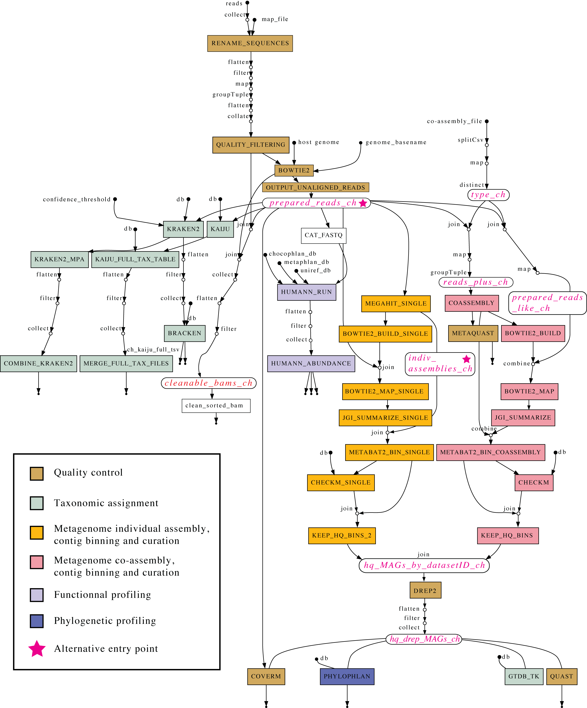

<!-- omit in toc -->
# Metagenomics-nf
[](README_FR.md)
[](https://github.com/AAFC-Bioinfo-AAC/metagenomics-nf)
[](https://opensource.org/licenses/MIT)

<!-- omit in toc -->
## À propos
Ce workflow Nextflow automatise de nombreuses étapes d’analyses métagénomiques, de l'étape de contrôle de qualité des séquences jusqu’à l'obtention de *Metagenome-assembled genomes* (MAGs). Il utilise différentes stratégies pour limiter le nombre et la taille des fichiers temporaires ou intermédiaires.

Le pipeline inclut plusieurs programmes de pointe dans le domaine de la métagénomique tels que MetaBAT, dRep, CheckM2, QUAST, PhyloPhlAn, etc. !

Il est facile d'explorer le code de ce projet puisqu’il comprend quatre composants principaux :

  * **nextflow.config** : permet de spécifier le profil et les paramètres des analyses, les ressources informatiques nécessaires à chaque tâche, etc.

  * **fichier .env** : contient des paramètres supplémentaires nécessaires à l’exécution du workflow.

  * **main.nf** : décrit la logique du workflow.

  * **dossier modules/local** : contient le code Nextflow pour chaque programme bioinformatique.

Il a été testé avec succès sur au moins deux systèmes de calcul informatique de pointe basés sur Slurm.

Des options booléennes permettent à l'utilisateur d'inclure ou d'omettre certaines parties du workflow : la branche Kaiju, la branche Kraken2/Bracken, la branche des co-assemblages.

Comme illustré dans ce [diagramme](docs/misc/flowchart.png), le pipeline est constitué de branches distinctes, dont certaines sont optionnelles.

Les fichiers d’entrée principaux sont des fichiers FASTQ *paired-end*, mais le workflow propose aussi des points d’entrée alternatifs : il est possible de démarrer à partir de *prepared reads*, c'est-à-dire des séquences préalablement nettoyées et décontaminées, ou encore de spécifier des assemblages individuels déjà obtenus (avec Megahit).

---

<!-- omit in toc -->
## Table des matières

- [Metagenomics-nf](#metagenomics-nf)
  - [À propos](#à-propos)
  - [Table des matières](#table-des-matières)
  - [Aperçu](#aperçu)
  - [Données](#données)
  - [Paramètres](#paramètres)
    - [**Paramètres généraux**](#paramètres-généraux)
    - [**Options d’exécution du workflow**](#options-dexécution-du-workflow)
    - [**Allocation des ressources**](#allocation-des-ressources)
  - [Utilisation](#utilisation)
    - [1. Dépendances](#1-dépendances)
      - [1.1 - Apptainer](#11---apptainer)
      - [1.2 - Nextflow](#12---nextflow)
      - [1.3 - Bases de données](#13---bases-de-données)
    - [2. Prérequis](#2-prérequis)
      - [2.1 - Préparation d’un génome de référence pour la décontamination](#21---préparation-dun-génome-de-référence-pour-la-décontamination)
        - [2.1.1 - Étapes pour créer un index Bowtie2 : exemple avec le génome du porc](#211---étapes-pour-créer-un-index-bowtie2--exemple-avec-le-génome-du-porc)
      - [2.2 - Préparation des séquences et du fichier map_file](#22---préparation-des-séquences-et-du-fichier-map_file)
      - [2.3 - Préparation d’un fichier map pour le co-assemblage](#23---préparation-dun-fichier-map-pour-le-co-assemblage)
      - [2.4 - Préparation de run.sh et des fichiers de configuration](#24---préparation-de-runsh-et-des-fichiers-de-configuration)
        - [2.4.1 - Script run.sh](#241---script-runsh)
        - [2.4.2 - Fichier .env](#242---fichier-env)
        - [2.4.3 - Fichier nextflow.config](#243---fichier-nextflowconfig)
    - [3. Exécution du pipeline](#3-exécution-du-pipeline)
      - [3.1 - Premier lancement et reprise d’une exécution avec run.sh](#31---premier-lancement-et-reprise-dune-exécution-avec-runsh)
      - [3.2 - Suivi de la progression](#32---suivi-de-la-progression)
  - [Résultats](#résultats)
  - [Crédits](#crédits)
  - [Contribution](#contribution)
  - [Licence](#licence)
  - [Publications et ressources supplémentaires](#publications-et-ressources-supplémentaires)
    - [**1. Documentation générale de Nextflow**](#1-documentation-générale-de-nextflow)
    - [**2. Contrôle qualité**](#2-contrôle-qualité)
    - [**3. Classification taxonomique**](#3-classification-taxonomique)
    - [**4. Assemblage \& Binning**](#4-assemblage--binning)
    - [**5. Profilage fonctionnel**](#5-profilage-fonctionnel)
    - [**6. Analyse phylogénétique**](#6-analyse-phylogénétique)
    - [**7. Déréplication et Affinement des MAGs**](#7-déréplication--affinement-des-mags)

---

## Aperçu
<p align="center">
    
</p>

---

## Données

Le pipeline traite des données de séquençage métagénomiques. Les différents types de données d’entrée incluent :

- **Séquences brutes** (*short-read*, *paired-end*, format FASTQ)  
  - Ces séquences vont subir un étape de contrôle qualité (*trimming*) et seront décontaminées pour y retirer les séquences de l'hôte avant toutes les autres analyses.  
- ***Prepared reads*** (séquences prétraitées après contrôle qualité)  
  - L’utilisateur peut fournir des séquences déjà nettoyées et décontaminées pour éviter les étapes de contrôle de qualité et de décontamination.  
- **Assemblages individuels** (contigs assemblés avec des outils comme MEGAHIT)  
  - Le workflow permet de sauter l’étape d’assemblage en acceptant des contigs déjà assemblés.  
- **Génomes de référence** (pour la décontamination des génomes hôtes)  
  - Des index Bowtie2 de génomes de l'hôte (ex. porc, vache) sont nécessaires pour retirer la contamination par l'ADN de l’hôte.  
- **Fichiers de bases de données** (pour l'annotation fonctionnelle, taxonomique et phylogénétique)  
  - Plusieurs bases de données externes sont utilisées, notamment :
    - **Kraken2 et Kaiju** (classification taxonomique)
    - **GTDB-Tk et PhyloPhlAn** (analyse phylogénétique)
    - **HUMAnN** (annotation fonctionnelle)
    - **CheckM2** (contrôle de qualité des MAGs)

---

## Paramètres

L’exécution du pipeline doit être configurée à l’aide du fichier `nextflow.config` et de paramètres en ligne de commande. Les principaux paramètres configurables incluent :

### **Paramètres généraux**
- `--reads`  
  - Chemin vers les séquences brutes (`*_R1.fastq.gz`, `*_R2.fastq.gz`).
- `--prepared_reads`  
  - Chemin vers les *prepared reads*, si disponibles.
- `--indiv_assemblies`  
  - Chemin vers les contigs préassemblés, si disponibles (obtenus avec MEGAHIT).
- `--map_file`  
  - Fichier de métadonnées liant les noms d’échantillons aux fichiers de séquençage.
- `--coassembly_file`  
  - Fichier de métadonnées définissant les groupes d’échantillons pour le co-assemblage.

### **Options d’exécution du workflow**
- `--skip_kraken`  
  - Ignorer la classification taxonomique avec Kraken2 (par défaut : false).
- `--skip_humann`  
  - Ignorer l'annotation fonctionnelle avec HUMAnN (par défaut : false).
- `--skip_kaiju`  
  - Ignorer la classification taxonomique avec Kaiju (par défaut : false).
- `--skip_coassembly`  
  - Ignorer le co-assemblage des échantillons métagénomiques (par défaut : false).
- `--use_prepared_reads`  
  - Utiliser les *prepared reads* au lieu des séquences brutes (par défaut : false).
- `--use_megahit_individual_assemblies`  
  - Utiliser des assemblages individuels préexistants au lieu d’exécuter MEGAHIT (par défaut : false).

### **Allocation des ressources**
- `--cpus`  
  - Nombre de cœurs CPU alloués par processus.
- `--memory`  
  - Quantité de mémoire allouée par processus.
- `--profile`  
  - Spécifie le profil d’environnement informatique (`hpc`, ou personnalisé).

---

## Utilisation

### 1. Dépendances

#### 1.1 - Apptainer

Ce pipeline est conçu pour être utilisé avec Apptainer. Pour construire les images Apptainer nécessaires, lire la documentation [ici](docs/apptainer_images.md).

#### 1.2 - Nextflow

Ce pipeline est écrit en Nextflow. Si vous n’êtes pas familier avec ce langage, vous pouvez en apprendre plus [ici](https://www.nextflow.io/). La [documentation](https://www.nextflow.io/docs/latest/) est riche et régulièrement mise à jour. Une bonne approche est d’installer Nextflow dans un environnement conda.

#### 1.3 - Bases de données


Plusieurs bases de données sont requises pour exécuter toutes les étapes du pipeline.

| Base de données | Module | Programme | 
| ----------- | ----------- | ----------- | 
| Chocophlan | humman_run.nf | Humann3 |  
| Uniref | humman_run.nf | Humann3 |  
| Metaphlan | humman_run.nf | Humann3 |  
| CheckM2 | checkm.nf | checkm2 |  
| gtdb | gtdb_tk.nf | gtdbtk |  
| Kraken | kraken2.nf | kraken2 |  
| Kaiju | kaiju.nf | kaiju |  
| Phylophlan | phylophlan.nf | phylophlan |  

Vous pouvez en savoir plus sur la configuration des bases de données dans notre [documentation dédiée](./docs/databases.md).


### 2. Prérequis

#### 2.1 - Préparation d’un génome de référence pour la décontamination

Un index Bowtie2 du génome hôte combiné au génome du phage phiX (inclus dans `data/genomes`) est nécessaire pour l’étape de décontamination des séquences brutes.

##### 2.1.1 - Étapes pour créer un index Bowtie2 : exemple avec le génome du porc

Téléchargez d’abord le dernier génome de référence du porc :

```shell
wget https://ftp.ncbi.nlm.nih.gov/genomes/all/GCF/000/003/025/GCF_000003025.6_Sscrofa11.1/GCF_000003025.6_Sscrofa11.1_genomic.fna.gz
```

Décompressez le fichier :

```shell
gunzip GCF_000003025.6_Sscrofa11.1_genomic.fna.gz
```

Combinez les génomes du porc et de PhiX :

```shell
cat phiX.fa GCF_000003025.6_Sscrofa11.1_genomic.fna > Pig_PhiX_genomes.fna
```

Construisez ensuite l’index Bowtie2 :  

```shellpr
mkdir pig

conda activate bowtie2
sbatch  -D $PWD  --output $PWD/bowtie2-%j.out  --export=ALL  -J bowtie2-build  -c 8  -p your_partition  --account=your_account  -t 300  --wrap="bowtie2-build Pig_PhiX_genomes.fna pig/pig"
```

Enfin, dans le fichier `.env`, définissez la variable d’environnement `GENOME` vers le chemin du dossier contenant les fichiers d’index du génome de référence.  
Dans cet exemple, si vos fichiers Bowtie index sont `/share/pig/pig.1.bt2`, `/share/pig/pig.2.bt2`, etc., alors définissez la variable `GENOME` à `/share/pig`.

---

#### 2.2 - Préparation des séquences et du fichier map_file

Les séquences brutes (paired-end, format FASTQ) doivent être placées dans le dossier `data/reads` et le fichier map_file dans `data/map_files`. Ce fichier vous permet d’associer les noms d’échantillons aux séquences métagénomiques correspondantes.

Le fichier map_file est un fichier .tsv contenant au moins 2 colonnes obligatoires : sample_read et file_name. L’idée est d’avoir dans la première colonne une expression correspondant à l’identifiant de l’échantillon suivi de _R1 ou _R2, et dans la deuxième colonne le nom de base des fichiers fastq correspondants. Voici un exemple :

| sample_read   | file_name                                |
|---------------|------------------------------------------|
|sampleName1_R1 |SampleName1_S1_L001_R1_001|
|sampleName1_R2 |SampleName1_S1_L001_R2_001|  
|sampleName2_R1 |SampleName2_S1_L001_R1_001|
|sampleName2_R2 |SampleName2_S1_L001_R2_001|  

Lorsque le paramètre `rename`  est défini à « yes », un procesus renommera les séquences en utilisant les valeurs présentes dans la colonne sample_read du fichier map_file.

Pour préparer un map_file conforme, les commandes suivantes peuvent être très utiles!

Dépendamment de la manière dont vos séquences brutes sont nommées, vous devrez ajuster la commande cut pour extraire le nom d'échantillon du nom du fichier original.

```shell
cd data/readsPréparation d’un fichier map pour le co-assemblage
printf "sample_read	file_name\n" >  ../map_files/map_file.tsv
for i in `ls *.fastq.gz`; do n=$(basename $i ".fastq.gz")
Vous pouvez en savoir plus sur la configuration des bases de données dans notre [documentation dédiée](./docs/databases.md).
; id=$(echo $i | cut -f 5 -d '.'); printf "$id\t$n\n"; done >> ../map_files/map_file.tsv
```

#### 2.3 - Préparation d’un fichier map pour le co-assemblage

Tenter de co-assembler un grand nombre d’échantillons métagénomiques (>10) avec MEGAHIT est une tâche fastidieuse qui peut prendre **des semaines** à se terminer ou bien de manière plus réaliste ne jamais se terminer ! Pour contourner ce problème, vous avez la possibilité de réaliser plusieurs co-assemblages, chacun contenant un nombre réduit d’échantillons (~2-10 échantillons).

Si vous souhaitez effectuer des co-assemblages, vous devrez préparer **un fichier de métadonnées distinct** spécifiant les groupes souhaités pour les co-assemblages, par exemple :

| sample_read   | file_name   | project   | sample_type | coassembly_group |
|---------------|-------------|-----------|-------------|------------------|
|sampleName1_R1 |SampleName1_S1_L001_R1_001|project_x|type_x|group_x|
|sampleName1_R2 |SampleName1_S1_L001_R2_001|project_x|type_x|group_x|
|sampleName2_R1 |SampleName2_S1_L001_R1_001|project_y|type_y|group_y|
|sampleName2_R2 |SampleName2_S1_L001_R2_001|project_y|type_y|group_y|

Le fichier de métadonnées de co-assemblage comporte 3 colonnes obligatoires : sample_read, file_name et coassembly_group.

#### 2.4 - Préparation de run.sh et des fichiers de configuration

##### 2.4.1 - Script run.sh

Éditez le script [run.sh](./run.sh) et attribuez au paramètre `--time` une valeur correspondant à votre estimation du temps requis pour que le pipeline se termine.  

##### 2.4.2 - Fichier .env

Le fichier `.env` est un fichier texte essentiel au bon fonctionnement du pipeline. Il contient divers paramètres nécessaires à l’exécution des processus. Ces paramètres sont principalement des chemins vers des bases de données et des réglages Slurm propres à votre environnement de calcul. Assurez-vous de remplir tous les paramètres avant de lancer l’analyse. Un [modèle du fichier .env](./.env) est fourni dans le répertoire du projet.

| variable   | Description |
|------------|-------------|
|CONDA_SRC|Chemin vers le fichier conda.sh de votre installation miniconda3. Typiquement `~/miniconda3/etc/profile.d/conda.sh`|
|NXF_APPTAINER_CACHEDIR| Nextflow met en cache les images Apptainer dans le répertoire `apptainer` ou `singularity` du répertoire de travail du pipeline, par défaut. Utilisez la même valeur que pour la variable WORKDIR.|
|SLURM_ACCT|Votre compte Slurm|
|PARTITION|Partition pour les tâches nécessitant moins de 512 Go de mémoire|
|PARTITION_HIGH|Partition avec plus de 1 To de mémoire|
|PARTITION_SUPER|Partition avec plus de 2 To de mémoire|
|CLUSTERS|Cluster Slurm à utiliser|
|APPTAINER_IMGS|Emplacement de vos images apptainer|
|WORKDIR|Emplacement du répertoire `work` de Nextflow. Le dossier peut finir par occuper plusieurs téraoctets ! Pensez à utiliser un dossier situé sur une partition scratch.|
|GENOME|Chemin du dossier contenant les fichiers d’index d’un génome de référence pour la décontamination|
|CHOCOPHLAN_DB|Emplacement de la base de données|
|UNIREF_DB|Emplacement de la base de données|
|METAPHLAN_DB|Emplacement de la base de données|
|CHECKM2_DB|Emplacement de la base de données|
|GTDB_DB|Emplacement de la base de données|
|KAIJU_DB|Emplacement de la base de données|
|KRAKEN2_DB|Emplacement de la base de données| 
|PHYLO_DB|Emplacement de la base de données|

##### 2.4.3 - Fichier nextflow.config

Ce fichier est lu par Nextflow et sert à spécifier certains paramètres importants, par exemple l’emplacement des séquences fournies en entrée, le nom et l’emplacement du fichier map_file, le dossier de sortie, etc. Les valeurs par défaut devraient convenir dans la plupart des situations, mais comme les systèmes de calcul informatique de pointe diffèrent d’une organisation à l’autre, il est recommandé de les revoir et de les adapter au besoin.


### 3. Exécution du pipeline

#### 3.1 - Premier lancement et reprise d’une exécution avec run.sh

Ce [script](./run.sh) permet de lancer ou de reprendre une exécution. Exécutez-le avec cette commande simple depuis le répertoire de travail :

```bash
 bash run.sh
```
#### 3.2 - Suivi de la progression

Trois fichiers situés dans le répertoire de sortie (`results/logs` par défaut) peuvent être consultés pour suivre la progression de l’analyse : 

- `nextflow.log`
- `stdout.out`
- `stderr.err`

À la fin d’une exécution, un rapport détaillé au format html nommé `report-YYYY-MM-DD-HHMMSS.html` est également produit dans le répertoire (`results` par défaut).

---

## Résultats

Les dossiers de sorties du pipeline sont dirigés vers le dossier spécifié dans le paramètre `results` du fichier `nextflow.config`. Par défaut, il s’agit du répertoire `results`.


---

## Crédits

Le workflow metagenomic_nf a été écrit en langage Nextflow par Jean-Simon Brouard (AAFC/AAC Centre de recherche et de développement de Sherbrooke). Les principaux blocs de ce workflow proviennent du travail de Devin Holman (AAFC/AAC Lacombe RDC), tandis que les scripts originaux ont été écrits en Bash par Arun Kommadath (AAFC/AAC Lacombe). Sara Ricci, de l’équipe de Renee Petri (AAFC/AAC Sherbrooke RDC), a également contribué à adapter ce workflow pour une utilisation avec des échantillons de vache. Mario Laterriere (AAFC/AAC Québec RDC) a contribué à la rédaction de la documentation et à l’adaptation du code afin qu’il puisse s’exécuter sans problème sur des infrastructures utilisant l'ordonnanceur Slurm.

---

## Contribution
Si vous souhaitez contribuer à ce projet, veuillez consulter les directives dans [cette section](./CONTRIBUTING.md) et veillez à respecter notre [code de conduite](./CODE_OF_CONDUCT.md) afin de favoriser un environnement respectueux et inclusif.

---

## Licence 
Voir le fichier [LICENSE](LICENSE) pour plus de détails. Consultez [LicenseHub](https://licensehub.org) ou [tl;drLegal](https://www.tldrlegal.com/) pour une présentation simplifiée de cette licence.

**Copyright (c)** Sa Majesté le Roi du Canada, représenté par le ministre de l’Agriculture et de l’Agroalimentaire, 2025.

---

## Publications et ressources supplémentaires

Le workflow Metagenomic_nf intègre divers outils de pointe pour l’analyse métagénomique. Vous trouverez ci-dessous des références et ressources clés pour les outils utilisés dans le pipeline :

### **1. Documentation générale Nextflow**
- [Documentation Nextflow](https://www.nextflow.io/docs/latest/)
- [Dépôt GitHub Nextflow](https://github.com/nextflow-io/nextflow)

### **2. Contrôle de qualité**
- FastQC : [https://www.bioinformatics.babraham.ac.uk/projects/fastqc/](https://www.bioinformatics.babraham.ac.uk/projects/fastqc/)
- MultiQC : [https://multiqc.info/](https://multiqc.info/)

### **3. Classification taxonomique**
- Kraken2 : [https://ccb.jhu.edu/software/kraken2/](https://ccb.jhu.edu/software/kraken2/)
- Bracken : [https://ccb.jhu.edu/software/bracken/](https://ccb.jhu.edu/software/bracken/)
- Kaiju : [https://github.com/bioinformatics-centre/kaiju](https://github.com/bioinformatics-centre/kaiju)

### **4. Assemblage et Binning**
- MEGAHIT : [https://github.com/voutcn/megahit](https://github.com/voutcn/megahit)
- MetaBAT2 : [https://bitbucket.org/berkeleylab/metabat/src/master/](https://bitbucket.org/berkeleylab/metabat/src/master/)
- QUAST : [http://bioinf.spbau.ru/quast](http://bioinf.spbau.ru/quast)

### **5. Annotation fonctionnelle**
- HUMAnN : [https://huttenhower.sph.harvard.edu/humann/](https://huttenhower.sph.harvard.edu/humann/)

### **6. Analyse phylogénétique**
- GTDB-Tk : [https://github.com/Ecogenomics/GTDBTk](https://github.com/Ecogenomics/GTDBTk)
- PhyloPhlAn : [https://github.com/biobakery/phylophlan](https://github.com/biobakery/phylophlan)

### **7. Déreplication et contrôle de qualité sur les MAG**
- CheckM2 : [https://github.com/chklovski/CheckM2](https://github.com/chklovski/CheckM2)
- dRep : [https://github.com/MrOlm/drep](https://github.com/MrOlm/drep)

Pour toute question ou problème, consultez la section [Issues](https://github.com/AAFC-Bioinfo-AAC/metagenomic_nf/issues) de ce dépôt.


